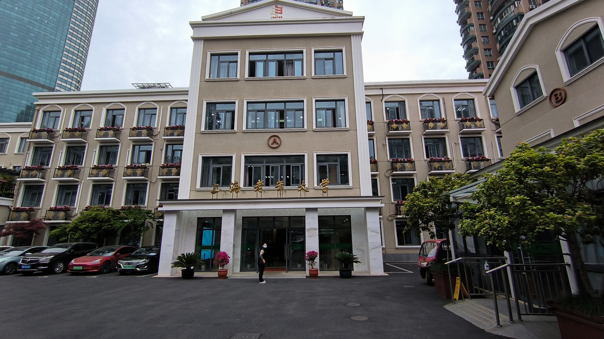

# 新时代下老年教育前沿的上海样板

**新时代下老年教育前沿的上海样板**

——“积极老龄观”引领下对**上海老年大学**的实地参访

**·项目简介**

近年来，伴随着我国人口出生率偏低、人口红利优势减退等话题，人口老龄化问题也日益成为大众关注的焦点。2019 年 11 月，中共中央、国务院印发了《国家积极应对人口老龄化中长期规划》，提出了“积极应对人口老龄化”的重大战略；习近平总书记指出，**“要把积极老龄观、健康老龄化理念融入经济社会发展全过程”**……

综上可见，我国高度重视应对人口老龄化，并以“积极老龄观”作为推进工作的指导思想，力图走出一条中国特色积极应对人口老龄化道路。

老年教育是老年人权益的重要组成部分。2002年，联合国《第二次老龄问题世界大会——政治宣言》明确提出，要所有人包括老年人都能享有“获取知识、教育和培训的机会”。在我们看来，老年教育对晚年生活的幸福美满具有重要意义，其开展地“老年大学”即是老年朋友们的精神福地。

上海是全国最早进入老龄化社会、老龄化程度最高的省级行政区，也是全国老年教育较发达的地区之一，已经形成**多层次、广覆盖、高质量的老年教育体系**。我们选定的实践地上海老年大学，现为上海市教育委员会的直属事业单位，是上海老年教育的示范基地、五所市级老年大学之一。

秉持探秘老年教育现实图景的初心，2023年4月、5月，我们团队实地探访了上海老年大学的南塘浜路校区（总部）与钦州书院校区，探索中国式老龄化应对的成功方案与前沿成果，拓展青年对老年教育的认知视野，为老龄事业蓬勃发展注入青春血液。

**·报告摘要**

`	`本次实地调研以“积极老龄观”为理念指引，以市级老年大学上海老年大学为实践地，获得对上海老年教育成就与现状的总体认知，吸收到对我国应对老龄化、推广老年教育的有益经验。

在实地参访过程中，我们不仅**沉浸式**体验到老年大学中老年教育开展的具体情况与优良氛围，而且切身感受到上海富裕发达的经济条件孕育的前沿成果。

成果报告一方面是对本次参访所见所得的总结，另一方面是期冀带领青年同胞们共同走到上海老年教育样板的幕后，目睹其样貌与成就。我们将以“参访经过+前沿总结”形式，分别聚焦两个校区的独特经验，最后提出目前存在的发展问题与改进空间。

**一、南塘浜路校区**

`	`4月14日周五上午，团队成员从复旦大学出发，到达上海老年大学南塘浜路校区（总部）。该校区位于徐汇区南塘浜路一条充满生活气息的巷子中。校门从临街的居民楼向外打开，走入校门，里面又是另一番洞天，坐落着总部的主楼与一旁的辅楼。说明来意后，门卫大叔热情接待了我们，显露出老年大学的温暖轻快的氛围。

与对接联系人党政办周慧老师碰面后，团队同该校区的老师、领导在主楼前合影，接着在教务办主任张老师带领下，首先参观主楼教室。我们边走边看的同时，张老师同步讲解了钢琴、古筝、书画、摄影、桥牌等课程对应的教室设计，并介绍了本校区的教学安排。从主楼下来，我们一同参观了辅楼及内部教室，注意到有些教室内学员较少，甚至有教室外的显示屏显示正在上课，但里面空无一人。原因为何？这就与上海老年大学的前沿探索有关。

`	`在总体观览以后，团队成员分为两组，分别旁听了时尚走秀课与烹饪课，与任课老师进行交流，充分体验老年教育氛围。之后，团队成员在三楼会议厅集合，同教务处两位老师展开座谈会。教务老师解答了上海老年大学的相关教学安排问题，我们也就调研的指导理念“积极老龄观”作了专题探讨。

`	`从实践过程与座谈交流中提炼，我们得到以下成果总结：

**（一）硬件设施：装潢文雅贴心，教具智能现代**

`	`上海老年大学坚持“以老年人为中心”，处处考虑到老年人的特殊性，比如，卫生间供给暖水、经常保持地板干燥防止老年人跌倒，走廊配备扶手，上楼时阶梯之间较矮，食堂的饭菜煮得较为软烂，都体现了用心的设计。

`	`主楼与辅楼内部装潢美观庄重，走廊两侧挂置了老年学员的摄影、绘画、书法作品，文化气息浓厚。

`	`对应不同课程安排了不同的硬件设施，这些设施大多先进完善，匹配课程特点。例如；该校区的优质精品课程钢琴课配备了许多电子钢琴；桥牌课配备四人牌桌；针对于讲座式课程，配备座位较多的报告厅；书画课程基本配备电子黑板，还有垂直拍摄老师纸面的投影仪，便于投屏和钉钉直播。

**（二）软件配套：顶尖师资力量，系统教学安排**

`	`南塘浜路校区设书画、外语、钢琴、计算机、文史、保健、家政、文艺、器乐、游学等10个系，100多门课程，包括基础班和研修班，覆盖线上线下，有学员近一万人次。上海老年大学所开设课程均是基于老年朋友的切实需求而设计，并且依靠市教委的大力支持从而拥有高水平的师资力量。

通过网络调研和教务张老师的介绍，我们体会到上海老年大学课程火爆程度远超想象。2018年以前线下报名时，学员常常在门口排长队，甚至凌晨排队。线上报名后，课程放出时也常常“秒空”。为享受到本校的优质课程与师资，不乏学员从松江、奉贤、崇明赶来上课。

为了让更多老年人能够体验到上海老年大学的课程，学校也建立了相应机制：报课年龄上限为80岁；一人一学期在总部仅能报名3门课，除了研修课可以自动进阶，基础课需要统一抢课。为应对不断增加的老年教育需求，上海老年大学和上海市其它20所老年大学、高校老年大学、民办养老机构一起组成了上海老年大学联盟，担任指导工作，共同增加老年教育供给。

`	`系统的线上课是上海老年大学的独家特色。之前我们提到，部分教室上课的老年学员较少，甚至出现“无人课堂”，这其实与疫情期间该校牵头的网课技能培训有关。疫情期间，为了推进课程开展，上海老年大学率先大规模培训学员使用钉钉在线上听课，取得了显著成效。疫情后，部分老年学员由于通勤距离、身体健康等因素，选择于家中上网课；遇到的一个“无人课堂”声乐研修课，也是由于老年学员对远在海外进修的老师恋恋不舍，双方协商后开展线上课程，老师甚至为了学员倒时差上课，充分展现出学员洋溢的求知热情与授课老师的尽职负责。

虽然上海老年大学已经打通了线上课渠道，但对于课程的系统性仍十分注重。例如开设的纯线上班，设定180左右的限制名额，学费8折且无需到校，严格规范课程考勤，一学期16次系统课，可以安排线下与老师见面。这样的安排，保证了课程质量，也有利于学员对课程、班级产生归属感，完全是讲座式的远程教育不可比拟的。

三种课堂模式，推动学习活动多元立体。除了 “校内上课”这第一课堂，上海老年大学为老年学员们开拓了第二课堂和第三课堂。第二课堂为社团活动，让学员们将第一课堂学到的内容实际应用、巩固提升。每个社团也配备了专业的指导老师，学生们可以外出进行一些社团活动，比如写生、摄影、表演等，这都是在传统教室里难以实现的。第三课堂则是老年志愿服务队，老年学员们作为志愿者进入社区，运用所学知识去辐射带动社区里的其它老人。疫情期间，网课培训的快速推广也有赖于老年志愿服务队，他们教会社区中更多的老年人使用智能手机，为消除数字鸿沟做出贡献。

在教学理念上，上海老年大学同样走在前列。针对于我们所提出的“积极老龄观”，教务办张老师回答，老年教育作为终身教育的最后一环，但并不类似继续教育学院的强目的性，而是真正的素质教育。老年教育的目的，就是“提升老年人的生命质量与生活品质”，并且“在学习中养老”，让老年学员观念不断更新。这契合了“积极老龄观”中的，“不是消极养老而是积极享老”，积极看待老龄社会，积极看待老年人和老年生活，将老年看作是人的生命的重要阶段；从经济发展角度，老年人并非社会的负资产，“不只是老年人之用而是发挥老年人作用”，积极开发老年人力资源，通过再培训和服务社区让老年人发挥余热。

同时，在老年教育上，从娱乐型向赋能型转变。我们一般认为，老年教育是一种为老年人提供消遣和娱乐的社会福利，老年大学开设的课程也以艺术、文娱类居多。当然，这类课程确实提高了老年人的生活质量，但在积极老龄观视角下，应“思想赋能”“健康赋能”“技能赋能”三管齐下。（1）“思想赋能”就是转变老年人观念，开展生命教育，钦州书院的生命教育学部即是重点实践案例。（2）“健康赋能”针对老年人最重要的健康问题，提升老年人的健康知识，从根源破解老年人“渴望健康但不知如何健康而屡屡受骗”的社会现象。（3）“技能赋能”则是从两方面入手，一是补足老年人数字生活技能，让他们融入现代生活，为此，上海老年大学专门开设摄影、智能手机、网课使用课程；二是对于老年学员进行简单的再培训，学会烹饪、表演等基本技能，服务家庭与社区。

**（三）老年学员与授课教师：认真热情，互助互学**

上海老年大学的师资力量强大，其授课教师来源渠道多样，约有四种类型：老师自荐后学校检验简历资历；学员共同推荐老师任课；大学老师退休后返聘；社会教学机构的专业年轻老师兼职。在上海老年大学，课时费相比校外非常低，受到大量学员的热捧，不乏上课超过十年的学员；很多授课老师为爱发电，亦师亦友。

我们对话了时尚走秀课的任课老师，她曾在东华大学教授形体健美，参与老年教育也有将近20年。在课上，前来上课的阿姨们都非常好学认真，老师在任课中也与学员们共同成长。经过学习，阿姨们的气质明显提升，走台时身姿美丽挺拔，绽放自信光芒。

在烹饪课上，烹饪课的教材由老师编写，从冷盘、荤菜，到西点、甜品，内容非常丰富，课程内容也会循序渐进，逐步学习更高难度的菜品。菜品设计上，老师充分考虑到了老年人的饮食需求，如我们参观时展示的菜品“孜然排骨”，为了方便老人咀嚼，排骨在制作时会加一道蒸的工序，使肉质更加软烂。除了讲解制作流程和注意事项，老师还会向学生们解释菜品制作中的原理，比如为何要冷水下锅、为什么要最后放糖等等。制作完成后，老师会把菜品分发给学生们品尝。

老师介绍，很多老人会把在课上学到的菜品做给家人们品尝，在家里很受欢迎。课后，一些学生并没有离开，而是围着老师询问他们在做菜时候遇到的问题，也会相互交流分享经验。“本来我已经觉得做得不错了，老师一说问题，我还能做得更好。”一位老年学员说。

`	`此外，10点的课程结束后，趁下课之际，我们访谈了一位结课准备离校的大爷。这位爷爷报名老年大学的课程多年，他是许多孜孜不倦、求知若渴的新时代老年人的一个缩影。爷爷不仅在总部上课，在钦州书院也报名了其他课程。他说，上海老年大学的师资力量很强，他上的诗词写作课老师是学富五车的退休教授；通过学习，他弥补了曾经文化水平不足的遗憾，并热情向我们展示他写作的多首诗词。

我们总结，上海老年大学不仅是一个“教学—学习”的场所，更成为了社区的人际网络生长、各类文化社会资源交汇碰撞的公共空间。老年学员们会利用食堂空间作为聊天会友的地点，他们相约一起吃中饭然后一起上课。可以说他们到老年大学不仅仅是为了学习知识技能，也是走出家门建立社交关系。而老年大学第二、第三课堂等各项平台又让老年学员们有机会反哺社区和社会。另外，校内许多授课老师自身也是老年人，或是退休的教授及文艺工作者，在老年大学教书让他们能够重新发光发热。

**二、钦州书院校区**

5月12日周五上午，我们到达了上海老年大学钦州书院校区。该校区位于徐汇区钦州南路，道路宽敞；校区大楼原为市教委考试院用楼，其搬迁后将整栋楼交予上海老年大学使用，足见市教委重视。钦州书院校区于2019年才开始启用，室内装潢与电教设备较新，在2023年恢复了线下教学，目前正在筹备开放日吸引更多老年学员。校区大楼共有7层，其中，大楼2-5层为教室，6层为办公行政区，7层为国际老年教育研究中心，并附带天台花园。

我们团队先与该校区的现代智能系部主任韩老师对接，她带领我们参观钦州书院校区大楼，了解教学区及课程安排；重点参观了5楼智慧生活体验教室“5个岛”，让我们见识老年教育全新的开展方式。体验该校区午餐后，我们同生命教育学部钱老师交流生命教育的开展状况。

`	`以下两个部分是钦州书院校区老年教育前沿探索的关键特色。

**（一）生命教育学部**

生命教育学部主任钱老师向我们介绍了生命教育学部的指导理念，并以“活出精彩”“肿瘤预防”等多个特色课程为例，讲解生命教育目前的开展要义、面临问题、发展方向。

`	`“生命教育”是当前被日益重视的教育理念，也是目前国内教育与国外相比的短板之一。上海老年大学钦州书院跟进国际先进理念，在原先保健系的基础上，融合多样课程升级为生命教育学部。过去的保健系侧重于健康知识的普及，而今天的生命教育学部则围绕“积极老龄观”开设了生理、心理、社会、法律等多个领域的各类课程。

“健康体验与智能就医”课程依托于钦州书院的“健康岛”进行开展，在健康岛中设置有真实还原的医院挂号系统和各类医疗仪器，以此为基础帮助老人学会健康云、电子挂号、网上医疗预约，从而尽可能避免医疗过程中的数字鸿沟。“老年生命教育生命之旅”课程，从生物细胞开始讲起介绍了人类生命发展中的各种生理知识，旨在帮助老年人从生物的角度认识到生命的发展历程，理解“生如夏花之绚烂，死如秋叶之静美”的生命观念。生命教育学部还开设有“肿瘤疾病与科学就医”、“活出精彩人生——老年生命教育”“太极拳普及与提高”等各类课程。未来还将开设法律课程，希望向老年人普及有关于遗嘱、房产、财富继承等方面的法律知识。

生命教育不同于琴棋书画，在老年群体中的认知率有限，为此上海老年大学充分调用社区资源推广“积极老龄观”的生命教育理念。在心理课程中，老师通过心理学专业知识告诉学员们人与人之间必然的社交属性，鼓励他们积极参与社区事务。同时，老年大学也提供了班长、志愿者团队等平台，鼓励老年人们将自己所了解到的积极老龄观和相关课程介绍给自己的邻里朋友，带动更多老年人走进课堂积极养老。

目前，在生命教育学部开设的课程中，部分课程已经得到了老年朋友的认可因此非常火爆，有些课程受欢迎度仍比较有限。为此，针对热门课程，生命教育学部依托老年大学搭建的线上平台，或是“金色学堂”等电视频道，使更多老年人能够足不出户就获得前沿的生命教育成果；而针对较冷门的课程，教务办想方设法提高接受度，如“肿瘤疾病与科学就医”是肿瘤医院团队开设的普及癌症防治知识的课程，但部分老年人看到“肿瘤”二字便觉得“戳霉头”不愿参与或是觉得只有得了肿瘤才需要学习，下学期教务办考虑优化课程的名字以吸引更多老年学员的加入。

在未来，生命教育学部的教务团队也展望，生命教育应该贯穿居民的全生命周期，幼年、青年、老年都应该学习如何面对新的生命阶段。同时青年儿童可以通过敬老和志愿服务参与到老年生命教育中，而老年生命教育也可以启发青年、幼年的成长，形成生命教育的互哺。

**（二）数字智能教育**

上海老年大学响应上级工作指导，打造终身教育数字化服务体系。该校区将5楼单独划归出来，构建了智能生活体验教室，由“生活岛”“金融岛”“快乐岛”“健康岛”“科技岛”5个分区组成，都采用了不拘一格的装修设计，配备最新教学体验设备。在韩老师带领下，我们对每个岛都进行了参观和了解，为老年学员能够体验到如此前沿的课堂模式感到振奋。

课程建设方面，钦州书院依托“智慧生活体验教室”，在出行、就医、消费、文娱、办事等方面开发了60多门体验式课程，通过模拟真实场景，将生活与教学融通，增强老年人学习、使用智能电子设备的能力。

楼内硬件设施方面，配备一流“智慧生活”体验设备，将“瀑布流”电子图书借阅机、手脉支付无人售货机、智能自助咖啡机、智能机器人等设置在各个楼层多个区域，让老年人在校园中可以随时触摸、学习和使用。同时，老年学员前来上课可以刷脸进校，测温防疫，通过班牌系统扫码签到、智能考勤。补充一点，上海老年大学也是全球首个5G覆盖的老年大学。

**最为特色、最成系统、最可借鉴的五楼五岛，尤其让团队成员们感受到数字技术、现代设备的强覆盖。**（1）在“生活岛”，本校与创维合作，构建了一整套智能家居教室，只需呼叫“小维”就能进行开关灯光、窗帘等操作；智能炊具可以用于投屏，便于边煮边学；通过体验，老年学员也会更乐于拥抱技术、购买智能产品。（2）“金融岛”中，安装了数字支付一体机，让快捷支付不只年轻人会使用；设置反诈挑战台，同中国银行等合作，提高老年人防范意识、金融知识；安放大众牌的汽车驾驶模拟器，让老年人也体验到驾驶的乐趣。（3） “快乐岛”稍小，但技术含量可不小。一个巨大的绿幕作为背景，前面则是演播摄影装备。实际上，这是让学员接触时下的虚拟演播系统，学习摄像、抠图与合成的专业知识。（4）在“健康岛”，配备有上海卫健委与万达信息联合推出的“健康云”仪器，与各大医院实时联网，实现老年人的远程问诊。（5）在“科技岛”，开设了“掌上生活一网通办”课程，教授老年学员使用随申办来办理养老、社保金查询等业务。与此同时，学校同字节跳动合作，开通了PICO品牌的VR体验教室。从未体验过VR设备的队员们有幸此次感受到最新科技。

可以注意到，五个岛采用同企业合作的模式，吸引社会资源，更高效地为老年人搭建桥梁跨越数字鸿沟。五岛体验教室不仅丰富了老年人的生活体验，也使得他们可以更自然顺畅地融入数字化社会，提升生命质量与幸福指数。

网络课程方面，钦州书院精心参与打造“直播课堂大课表”，提供精品老年教育线上课，推进全市层面的共享。我们所看到满是摄影设备的录播室，就致力于将校内精品课程通过“金色学堂”频道向所有老年人推广。钦州书院切实将“积极老龄观”与先进数字技术相结合，为上海老年教育形成多层次、广覆盖、高质量的老年教育体系起到了不可或缺的先锋作用。

**三、存在问题与改进空间**

在同总部教务办张老师、钦州书院钱老师与韩老师的交谈中，我们也获悉以下老年教育存在的问题和可以改进的空间，也以期未来的实践项目、科研空间可以关注此类问题，作出实际调研与难题攻关。

**1.如何平衡多样性与统一性。** 老年教育相比其他学段教育的显著特征，就是课程设置、教师招募、教材编写等教学安排具有很大的多样性，由于各自校区的特殊性，很难达成统一的安排，每个学校差异较大。**这一方面有利于灵活开展教育，弥补资金不足；另一方面也对老年教育的标准化体系化提出挑战。**目前我们了解到，华东师范大学正在搭建老年教育教材编写中心，长三角地区就老年教育问题正在开展一体化探索。

**2.如何针对老年人身心特点设计课程。** 当老年教育从单纯的娱乐型转变为赋能型，也需要关注怎么开课、怎样讲课才能让老年人易于接受。类似于之前提到的许多生命教育课程，也在探索优化名称、拉动年轻老年人宣传等路径。

**3.老年教育资源的普惠性问题。** 正如前文所说，上海老年大学课程极为火爆抢手，凸显出当下老年教育供不应求的问题。根据数据，2022年，仅上海60岁以上的户籍老龄人口已达550多万，其中能够到老年教育机构中接受教育的人数仍然有限。

**4.上海地区老年教育经验的推广问题。** 在调查中，我们也了解到各地老年大学团队会到上海老年大学交流、取经。但是，上海地区的经济发展水平很高，许多老年人口富裕且素质很高，在老年教育上愿意付出大量的资金与精力。因此，对于其他地区来说，吸收上海老年教育的经验需要因地制宜。

**·本次项目的主要参考文献**

张兴. 上海老年教育四十年[J]. 中国成人教育,2020(7):67-73. 

陆黎英. 上海老年教育发展现状及对策研究[D]. 上海:上海交通大学,2005.

吴玉韶. 把积极老龄观融入养老服务全过程[J]. 中国社会工作,2022(14):8. 

胡湛,彭希哲,吴玉韶.积极应对人口老龄化的“中国方案”[J].中国社会科学,2022(09):46-66+205.

王远,马宪国. 学习型城市建设中的上海老年教育[J]. 老年教育（老年大学）,2022(6):33-35.

**·以下网站、新闻报道同样也为我们了解老年大学提供了丰富信息：**

上海老年大学 – 官网

探访全面恢复线下教学的上海老年大学：260门课门门秒杀，这些最抢手

探访钦州书院（一）｜拥有一流硬件，软实力配套跟上了吗？ 

问策上海2025｜卓越全球城市视野下的老龄化应对

让老年学员跨越“数字鸿沟”，上海打造终身教育数字化服务体系

老年大学火爆，拒当带娃工具的上海老年人
