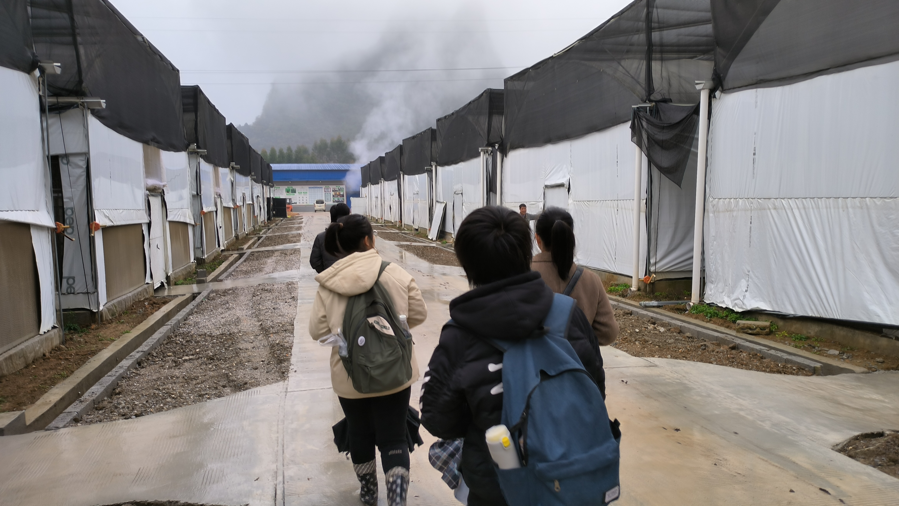

# 柳州螺蛳粉产业带动乡村振兴走出多元模式

**柳州螺蛳粉产业带动乡村振兴走出多元模式**

——寒假“跟着总书记看中国”实践活动调研报告

**·项目简介**

`	`习总书记曾经上山下乡，深切体会农民的生活艰苦，一直念念不忘父老乡亲对美好生活的向往。在新时代下，乡村振兴提上日程、全面铺开，亟需年轻大学生的实践考察，将成果写在大地上，总结乡村振兴的有益经验，探寻深化发展的优化空间。

`	`螺蛳粉自2020年以来逐渐在全国知名，成为柳州城市名片，袋装螺蛳粉同年成长为百亿产业……这些佳绩，逐渐将为袋装螺蛳粉提供原材料的螺蛳粉小镇从幕后推到台前。2018年，柳州市柳南区太阳村镇数个村屯联合申报，办成螺蛳粉小镇；在螺蛳粉产业的带动下，这些村屯走出了乡村振兴的多元模式。在这样的背景下，我们由社会科学试验班、技术科学实验班各两位同学组成的广西乡村振兴实践分队，响应“跟着总书记看中国”主题社会实践的号召，走进螺蛳粉产业的背后与乡村振兴的前线，通过网络调研、实地走访等实践方式，试图揭开家乡农村变化发展的面纱。

**·前期准备**

`	`2023年后一月底，我们4人组成团队，着手准备实践项目。经过前期网络调研，发现总书记柳州之行曾到螺蛳粉小镇参观生产，为了契合“乡村振兴”主题，最终我们敲定了柳州螺蛳粉小镇作为实践地点。

`	`之后，我们开展会议讨论活动方案，确定访谈提纲和行动安排。在出发前，团队成员通过电话联系柳南区政府、太阳村镇政府提前了解了实践地的概况，为实地实践做好准备。

`	`在各方面基本安排完毕后，我们开展了为期三天（2.8-2.10）的实践活动。

**·调研点位与收获总结**

`	`柳州螺蛳粉小镇位于柳州市柳南区太阳村镇，是螺蛳粉米粉、酸笋、螺蛳、木耳、豆角等袋装螺蛳粉重要原材料的生产基地。

**一、螺蛳粉小镇会客大厅：品牌带动，政企合作**

螺蛳粉小镇会客厅是小镇的标志性建筑，是小镇与柳太路连接的门户。现开放一家天桥螺蛳粉，游客可以在此处品尝正宗螺蛳粉的美味，还可以购买天桥预包装螺蛳粉，将特色小吃带回家。实践第一天，我们与经营负责人展开交谈，大致了解了粉店经营状况；同时询问了负责平台直播的小姐姐网络销售的相关情况。

经政府统一规划，天桥螺蛳粉在小镇客厅开设门店，并与螺蛳粉小镇联名形成品牌。近年，天桥开始运用预包装模式扩大销量。礼品盒、包装袋的外观设计包含米粉、螺蛳、鸭脚等美食元素，远处是喀斯特地貌的翠绿山峦，粉袋包装还展现了柳州三四月盛开全城的紫荆花的独特风光，体现螺蛳粉之味美、柳州城之景美、广西山河之壮美。春节旅游旺季，3-4天螺蛳粉小镇线下共销售约一万份产品（每份六袋）；天桥螺蛳粉还在各大平台开设网店，我们在现场看到，小姐姐使用多台手机，在抖音等多平台同时直播，直播内容即螺蛳粉小镇内天桥螺蛳粉门店的日常经营。

天桥门店为太阳村镇的乡民提供了一些就业岗位，村镇生产的木粉、豆角、酸笋等原料也有一部分供应到这里。为打造“源自螺蛳粉小镇，只做原汁原味”的优质品牌，定期有视察组来考察米粉的生产流程，天桥严格把关食品安全、产品质量，让来客享受到醇正、健康的柳州美食。

**二、百乐村：多方协力，一村一品**

`	`百乐村是螺蛳粉小镇集群中的一个重要村屯，特产产业是竹笋种植，其历史可以追溯到上个世纪90年代。从最开始几户村委带动种植，到后来越来越多村民退桉种竹，再到近年来柳州市做大做强螺蛳粉产业，竹笋的需求量大幅度增加，保障了笋果的销路。百乐的竹笋种植产业不断发展，如今毛竹种植面积已经超过4500亩。

我们实践团队首先来到百乐村村委，从热情待客的村委副书记廖正建处，了解到百乐村的基本情况，他也回答了关于百乐村参与螺蛳粉产业的状况的相关疑问。

进村以后，于村小卖部中，热情开朗的伯伯黄继达详细地为我们讲解了百乐村竹笋种植的起源与发展，介绍了竹笋的种植过程与养护；更关键的是，他帮忙联系到村中从事竹笋腌制加工的黄继华。我们到达黄继华先生的竹笋腌制加工基地后，见到了处理厂中事务的黄继华先生。我们参观基地的生产状况后，他热情地配合了我们的访谈，为我们提供了百乐村发展的丰富经验。

通过走访和调查，实践队员们最终逐渐勾勒出了百乐村竹笋产业的全貌。

螺蛳粉小镇的周边村镇主要是袋装螺蛳粉的原料生产基地，包括豆角、竹笋、木耳、蔬菜的种植、螺蛳的养殖，并形成了较大规模的产业集聚，由此带动了乡村经济的发展、村民生活的改善，是乡村振兴活生生的典范。

`	`百乐村就是一个全村参与螺蛳粉产业链并走上致富之路的佳例。百乐村内有着大片竹林，村民自主管理，每家每户都拥有一片或大或小的竹林。村里形成了经济合作社，向村民收购竹笋，再销往加工厂或店面，为农户畅通了销售渠道，促进了共同富裕。

`	`目前在柳州其他村镇地区，年轻劳动力特别是成年男性，大多外出打工寻求更高的经济收入，为了不让自家地丢荒，大多都种满了桉树。桉树需要的养护较少，一年只需一两次施肥，但一定程度对环境（土质、水质）破坏较大，且5年只有一次性收获。而在百乐村，竹笋种下3年后即可多次收获，从6月到10月有4个月的收获季节，产量较大，品质优良，售价好、收益高，与此同时也需要更精细的田间管理和人工收获。由此下来，百乐村许多年轻劳动力得以留在村中，在家门口就能赚到钱，过上小康生活。据我们的观察，百乐村内几乎家家都有2层以上的院宅，房屋装修美观，私家车拥有率也较高。

`	`在百乐村竹笋产业的发展过程中，村委、村民、政府三方齐心协力，最终让百乐“一村一品”得以可能：

起初，几位有胆识的村民在1996年左右，引入竹笋在山上种植，但当时销路有限、种植经验也不足。然而，他们克服困难、敢为人先，在种果树情况不佳、普通农作收入不高的状况下，闯出一条新路，为村民指明方向。种笋逐步发展后，村委加大支持力度，村委带头种起来给村里面的人承包，现已形成家家种笋的规模化格局。

自治区政府会定期下派农业技术人员，来对竹林生长状况进行评估，防病防虫，为村民提供养护指导；柳南区政府农业农村部出台高补贴水平的种笋政策，800-900元/1亩，同时鼓励退桉种笋；市政府也会在螺蛳粉小镇开展文化节、音乐节，带动周边旅游发展，参观百乐竹海，迈向一二三产业融合发展。

黄继华先生的笋果生产基地也蕴涵了大量乡村振兴经验。黄先生2006年自广州返乡帮父母种植管理竹笋，之后将竹笋腌制这件家庭分散自制的工作做到产业化、规模化，现在能够准确控制口味、确保质量，一路走来并不容易。从对黄先生的访谈中，我们得到以下收获：

①带动效应：竹笋腌制厂做大做强后，形成“合作社+基地+农户”模式，成立“柳州市笋鲜种养合作社”向村民收购竹笋，畅通百乐村竹笋销路，携手村民共同富裕。

②经验输出：在政府鼓励和宣传效应下，带动周边其他村屯村民种植竹笋。黄先生应政府合作要求，为其他村镇提供竹笋种苗，配套种植与管理经验。

③成立品牌，加大宣传：申请商标，保护生产成果；2021年，黄先生作为百乐村致富带头人，出镜央视《走进乡村看小康》节目，提高百乐村的知名度与竹笋产业信誉。

④克服困难，充分规划：

事业之初，为打通竹笋销路，常跑市场销售自家产品，后来慢慢与多家螺蛳粉门店合作。由于工厂体量较小，酸笋少量供给螺蛳粉工厂，主要销往实体门店。现在螺蛳粉爆火，酸笋供不应求。事业当前，需要妥善管理更为庞大的资金链，因为大量收购村内竹笋，需要向村民预支订单，资金要求高。事业未来，计划扩大生产规模，同时提高产品品质；推动产品多样化，生产可以进入普通百姓家的竹笋产品。

⑤品质保证：坚持用山泉水不用纯净水来腌制，精确控制涝水和山泉水的比例，确保酸笋风味一致。符合国家食品标准，保证食客的健康。

综合百乐村的产业案例，我们可以看到“一村一品”背后各方的齐心协力。百乐村的成就是特殊的，也是幸运的，可作为乡村以特色产业破局的典例。黄继达先生认为，螺蛳粉小镇在此选址，百乐村功不可没。

**三、山湾村：土地流转，规模经营**

太阳村镇山湾村位于柳南区螺蛳粉小镇核心区内的中心位置，距市中心15公里。山湾村探索出一条“党建引领乡村振兴，五治共建幸福山湾”的乡村善治之路，先后获得全国乡村治理示范乡村、2021年中国美丽休闲乡村等荣誉称号，是具有典范作用的生态村、富裕村、文明村。

实践第一天，我们走进山湾村，向村委的工作人员和居住在村里新农村项目楼房的老人了解山湾村的基本情况，对本村人口组成、土地流转等问题形成大致认识。第三天，我们回村回访，来到小要屯附近的绿都现代生态农业示范园。接待中心的介绍员小哥带领我们观览了蔬菜基地，使我们对山湾村的经营模式有了初步了解。

与特例百乐村不同的是，山湾村的人口组成与当前农村的普遍状况一致，即年轻劳动力以基本外出务工为主，务工地点有较近的镇上、市区，也有较远的外地。结果就是，除却留在村委工作的少量人员，留在村中的大多是老人。这般格局是由村中的生产经营模式决定的：在没有出现百乐村一般创造足够营收的特色产业的情况下，村民从事的农业劳作受自然条件影响大、产值低、周期长，为了应对日益增长的生活成本与孩子的教育支出，年轻劳动力只能外出务工寻找更好的经济机会。由此以来，村民更愿意选择将自家土地流转，老板承包后就形成了规模化的蔬菜种植基地，降成本提营收后也可以向村民支付更多的租金。

`	`我们参观的蔬菜大棚是绿都现代生态农业示范园的一小部分，该农业示范园由柳州市蔬菜副食品有限公司（以下简称“柳蔬公司”）投资建设，而该公司又隶属于我市农业基础设施投资建设集团有限公司（以下简称“农投集团”），是国有资本参与运营的一家企业。柳蔬公司负责农投集团下农业种植基地建设的重要业务，参与和承担柳州市乡村振兴规划重大项目建设，推动打造现代大农业。该示范园以示范性种植为主，大棚兼具美观和生产功能，集成应用果蔬育种技术、设施栽培技术、水肥一体化灌溉技术等现代农业科技，全方位打造集绿色无公害果蔬种植、科研成果示范和推广、农业技术培训、农耕研学活动于一身的综合性现代农业开发示范基地，拥有显著的品牌效应和示范带头影响力。

我们在调研中发现，蔬菜大棚中配备了温度湿度检测、无水装置栽培等令参观者耳目一新的技术，在冬日仍种有生菜、番茄等果蔬。我们还参观了大棚内的夏日降温装置、水肥配置间，了解到自动灌溉、驱虫、作物授粉、吊蔓种植、对照用药等许多种植技术细节，大大加深队员们对农业的认识。以此行对我们大学生的震撼程度来看，农业示范园对学生具有很强的吸引力，对认知世界、实践能力的培养功用显著。

在乡村振兴方面，**第一，** 示范园与螺蛳粉小镇可以相互带动，提高旅游收入。目前，周末时有市民会前来示范园体验采摘，实践队员们也亲历了大棚内的采摘活动。示范园计划，在疫情稳定后种植更多品类的作物，扩大规模、提高吸引力；旅游研学方面，目前介绍栏等信息已完善，之后正在规划在附近大草坪建设烧烤场，提升可玩性。**第二，** 在夏天，示范园露天菜园会种植豆角，作为螺蛳粉的原材料供应。除此之外，示范园通过雇佣小要屯村民，也实现了当地人的就业。中年村民外出不便，但多是家中支柱，可以通过该项目获得更为稳定的收入和陪伴家人孩子的时间。

介绍员小哥提到，示范园以及其他农村地区交通不便、农村人居环境不佳等问题，都会影响到人才的引入。俗话说“火车一响，黄金万两”，人才下乡支农亟需、环境建设的跟进。在当下，年轻人才拥有更广阔的见识与更专业的学识，能以新鲜血液激活广西改变落后的农业种植与经营模式，推动现代农业做大做强。

**四、四合村：民营创业，探索前行**

四合村位于柳州市柳南区，靠近螺蛳粉小镇周边。在多年前四合村还较为贫困，但近几年在区政府的大力扶持和村委的共同努力下，四合村已实现了全面脱贫。四合村周边山岭林立，是典型的喀斯特地貌，人均耕地较少，劳动力流出较多。然而，四合村村民也在积极探索农业发展路径。刘天义刘总正是四合村大榨屯知名致富带头人，他对农村因劳动力短缺和家庭联产承包制约现代农业发展有着切身的体会，认定农村以土地流转、集约经营为主的现代农业改革势在必行。2017年，刘总创办添翼种养专业合作社等企业，参与太阳村镇蔬菜种植产业基地的建设，以产业示范带动模式引导太阳村镇有劳动能力的贫困户自主参与，带动村民共同致富。我们实践团队正是慕名而来，探访乡村振兴的重要经验。

从四合村委一路步行至大榨屯，我们首先来到四合水果示范园了解情况。该基地目前处于某公司承包状态，几百亩的橘黄的沃柑挂在树上，无人采摘。我们了解到，几年前在广西，沃柑品种好、收价高，是项目经营的优良选择。但随着全国柑橘市场的打开，广西地区农民跟风种植，柑橘种植园日益增多，产能过剩，造成滞销局面或亏本低价售出。此外，由于选品问题和气候变化，本地果树今年患病较多，收成不好，相比其他地区该果园的沃柑市场竞争力明显下降。同时，该果园居于深山盆地，位置相对偏僻，交通不便，曾经开设的研学和旅游观光项目无人打理，第三产业创收较低。

不过，果园的存在也为村民提供了一定的就业机会，许多中年村民不便外出打工，在农闲时节可以在果园帮工，补贴家用。果园在种植葡萄的时候还采用了水肥一体的生产模式，可以提高管理效率，减少生产成本。

从坡上的果园来到马路边，我们遇到了负责此处蔬菜种植大棚的唐林大哥，在这里我们见识到了民营创收的智慧卓识。

原先此处大棚是政府投资建设的豆角种植基地，由于其他原因荒废，对外招人管理。唐大哥接手了此处蔬菜大棚，减少了建设成本。大棚可以保温抗风，减少天气状况对农业生产的影响，四季种植增加产出。其次在大棚内部，唐大哥巧妙利用空间结构，可同时种植辣椒、小葱、瓜类等作物，提高了土地利用率。与我们在山湾田园党校看到的大棚类似，都采用无土栽培的方法，规整的种植摆放方便游客的参观和采摘。唐大哥个人也对国家助农政策有独到了解，主动学习现代种植和管理方式，利用媒体宣传增强知名度。

除此之外，唐大哥还承包了螺蛳粉小镇会客厅旁的闲置土地，用于种植赤松茸，并为游客提供采摘游玩项目。之后，唐大哥带我们参观了松茸储存冷库与烘干房，自种自收的松茸就送到此处，烘干后售往区外。

我们也了解到，唐大哥除了自己承包土地自己经营，同时也担任刘总旗下广西好望角农业有限公司的技术员。他带领我们参观了公司的木耳养殖基地，基地正在扩建中，由政府和刘总共同出资。该基地生产培养木耳的菌孢瓶，也搭建大棚直接种植木耳。在木耳种植的生产链上，公司搭建了菌孢瓶机械化生产设备，因此不仅对外售卖菌孢瓶，也出售基地种植的木耳作为螺蛳粉的原料供应，打开创收渠道。生产车间采取机械化模式，干净整洁，效率较高，也能提供一定工作岗位。

通过在四合村的走访，我们总结得出，乡村振兴不仅要依靠政府扶持，村民的知识才干与经营水平同样关键，探索出一套适宜的生产模式对乡村长期创收尤为重要。实践团队在走访过程中了解到村里两种不同的生产模式，各有特点，收效不同：一种是“小公司自营+雇佣零工”模式，一种是“规模化公司+政府合作”的模式。共性是都承包村民土地建成大规模的种植基地，但后者相对更加成熟，也更容易受益于政府助农政策，是在农业市场中生存的可借鉴案例，为乡村振兴、村民创业提供了有益参考。

**五、新农村项目：宜居新村，振兴范本**

2011年，山湾村启动土地增减挂钩项目，到现在已建设别墅310套，共占地72亩。走进村子，便可见到整齐排列的新房，干净宽敞的水泥路，新农村的一条干道上，沿路张贴着致富带头人与最美家庭介绍。村头建设有一座小型风雨桥，在村大队处也建设有篮球场与螺蛳文化大舞台，基础设施完善。

山湾村村委庭院内，还建设有一座螺蛳文化展馆，装饰精美，内容丰富，为前来的游客和调研团队提供了详实的柳州螺蛳文化介绍。我们团队在游览螺蛳文化展馆的过程中，了解到柳州地区人们食用螺蛳的历史，也认识了山湾村淳朴的乡情和民族融合特色。

与此同时，我们发现在新时代下，山湾村在党建引领下发生了脱胎换骨的新变化，提炼出重要的乡村振兴经验：

①	强化组织领导，加强队伍建设。山湾村党支部积极开展党的群众路线教育实践活动，夯实党投入乡村振兴的组织基础。

②	**搞好土地综合整治，推进新农村建设。**山湾村自实施城乡建设用地增减挂钩项目以来，取得了良好的经济和社会效益，为构建城乡一体化发展新格局破解了“三农”难题，在解决深化农村改革、促进农民增收和节约集约利用土地等问题上探索了一条新路。从**新农村项目的信息公示**中，我们了解到：太阳村镇在增减挂钩项目建设中，以项目建成后累计获得的各类土地指标收益作为增减挂钩村民集中安置区建设来源，得到了村民支持，成功打造了美丽乡村工程。利用城乡建设用地增减挂钩土地出让指标收益获得的6.7亿元，反哺项目安置区和基础设施建设，使得群众的生活、生产环境得到改善，乡村风貌焕然一新。

③	优化生产条件，做优特色产业。山湾村大力推进土地平整规划，全面实现了“田成方、树成行、路相通、渠相连、旱能灌、涝能排”的生产新格局，为规模经营和发展现代农业创造条件。通过引进柳州市绿都现代生态农业示范园项目，在完成平整的土地上建设大型高科技大棚，并在未建设大棚的土地种植多种特色蔬菜。

④	丰富群众文娱生活，展现文明新风。2012年12月，成立了山湾村文艺队和篮球队。两支队伍丰富了村民的业余生活，树立倡导了文明新风。

⑤	推进生态乡村建设，营造舒适生活环境。自“美丽广西生态乡村”活动开展以来，山湾村积极响应，党员干部带头，组织村民齐参与，创造条件实施“村屯绿化”“饮水净化”“道路硬化”三个专项活动，使村屯普遍增绿、生活生产用水提质、道路基础设施有效改善。

访谈过程中，一对老夫妇表示，搬进新房，有旧房拆除的补贴，平时只需要交电费，卫生条件也比老房子好很多；新房宽敞，过年的时候，与子女们团聚，年夜饭可以摆下三桌。同时，旧时的邻里关系并没有疏远，村民们经常串门唠家常。山湾村距离太阳村镇上较近，也有通畅的水泥马路，从村到镇上买菜、休闲十分方便。

队员们亲身走访山湾村，切身感受到了新农村建设给村民们带来的生活改观，也体会到村民们对未来美好生活的期待。

**六、问题与反思**

经过实际调研走访，队员们同样发现乡村振兴中存在的不少问题。

1. 从螺蛳粉小镇总体情况观察，2018-2019年大力宣传过后，热潮褪去，目前小镇只剩下飞行营地、百乐竹海、天桥螺蛳粉几处保留热度。官网和公众号较久未更新，但实际上节假日到访小镇的游客并不少。我们推测，螺蛳粉小镇位于郊区，区位条件一般；地理位置与柳州市向东发展的趋势不符，得到扶持较少；小镇由多个村联合申报而成，缺乏统一的管理机构，运营缺乏人手。
2. 会客大厅处原先由融创集团负责，但由于公司资金短缺，出现烂尾楼、展览馆关闭等现象。曾经计划建设的部分项目也无法开工，但好在闲置土地已经得到再利用。
3. 山湾村部分中年村民，可能由于政策宣传不到位、早些年经济困难、政策意识不足等问题，没有跟进养老金政策，只能享受到每月一两百元的微薄补贴，生活存在一定困难。
4. 原先我们到访山湾村，意图寻找到小镇地图上标注的“千亩螺田”，而这是当地运营存在问题的一个项目。从实地考察的状况看，“千亩螺田”的划定范围仍旧保留，田内无水，只保留收割后的稻杆。从当地人口中我们了解到，由于2022年气候异常、田间干旱，螺蛳由于缺水大量死亡；也有说法是螺蛳从外地引进，不适应此地气候，生产无法持续。同时，也可能有投资企业项目管理不到位，缺乏资金人力支持的状况出现。原先该项目采用“稻螺套作”的先进模式，然而稻谷的种植也难以盈利，还需要政府的补贴和山湾村村民的内部消化。我们认为，“千亩螺田”项目是乡村振兴过程中的一记警示。当然农业生产中存在不确定因素，对投资方、政府方、运营方协作的要求较高，但是建议相关项目开展要合理全面研判、体现当地优势，完善运营及后续处理方案。
5. 四合村自营果园经营状况不良，映射出广西水果产业同质化种植、市场缺乏良性循环等问题。

我们深刻意识到，习总书记反复强调“中华民族伟大复兴，绝不是轻轻松松、敲锣打鼓就能实现的”这句话的正确性。我们认为，在今后的工作中，各级政府、村委村民、社会资本等各方应建立长效合作与沟通机制，协商乡村振兴策略，加强行动落实见效；结合目前经济状况，未来制定合理的扶持政策，并贯彻已经拟定的产业政策。相信在政府的引领与人民的奋斗下，柳州螺蛳粉小镇能够可持续发展，走好乡村振兴、共同富裕之路。

**·项目总结**

`	`作为我们团队成员首次参与的社会调研活动，本次“跟着总书记看中国”主题实践丰富了队员们开展活动、自主策划的经验，增进了农业生产实践、乡村基层运行的相关知识，挖掘到家乡振兴乡村的喜人成果与改进空间。在为期三天的调研中，我们亲身走进百乐、山湾、四合等村屯，与村官、村民亲切恳谈，接地气、探民情，力图展现柳州螺蛳粉小镇的独特模式。

`	`最后，我们获取了丰富的影音、访谈与文字资料；整理后，我们写成数千字的通讯稿与调研报告，总结概括出百乐“一村一品”、山湾“规模经营”、四合“民营求索”等多种模式，展现螺蛳粉小镇的乡村振兴成果。同时，我们制作出实践活动vlog，发布通讯稿推送，以求推广宣传家乡的魅力小吃，让更多人深入了解爆红的螺蛳粉背后辛勤付出的劳动人民与大力支持的各级政府。

`	`今年是举国疫情后再出发的关键元年。站在新的历史起点上，我们作为未来建设新一代的复旦大学学生，积极思考与响应国家“乡村振兴”的战略部署，希望以亲身经历讲好中国故事，用交流反思共促中国式现代化。我们的家乡广西，是改革开放后发展延迟的沿海省份，工业化路途艰远，农业仍为重要产业；而柳州作为工业重镇，近十年亦是发展曲折，在转型路上盼求曙光。因此，广西的年轻一代更要意识到肩上重任，在百年未有之大变局持续演进的未来，携手家乡迎头赶上，以特色破局，献青年力量！

**·团队信息**

傅靖萍：分队负责人；

廖书伦：团队成员；

张锴彬：团队成员；

梁雨璐：团队成员。

每位队员参与了前期对螺蛳粉小镇等地点的资料搜集，共同讨论方案策划，并事先了解实践地。实践过程中，队员们共同开展访谈，主动获取照片、图文、录音等珍贵资料，为后期整理和报告撰写做好准备。实地走访结束后，队员们分头整理资料，制作vlog，撰写通讯稿和报告，最后汇总整理，实现了全周期实践参与。

